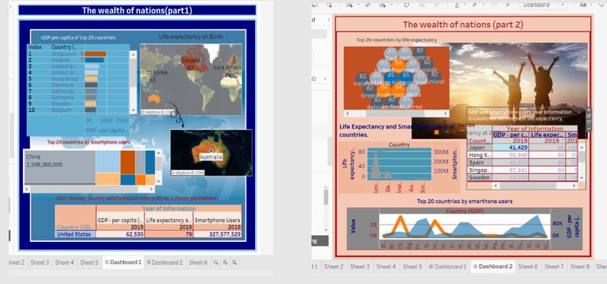

## Excel and Tableau 



````diff
- Purpose: 
To show understanding and ability to clean the data in Excel, the establishment of relationships, their reflection and visualization in Tableau.
 
+ Techniques used:
Cleaning the data, creating the table, filtering the table, sorting the data by client requirements, analysing the information,  creating charts and dashboards.
[link](https://public.tableau.com/views/Thewealthofnationspart2/Dashboard2?:language=en-GB&:display_count=n&:origin=viz_share_link)


[link](https://public.tableau.com/views/Thewealthofnationspart2/Dashboard2?:language=en-GB&:display_count=n&:origin=viz_share_link)
